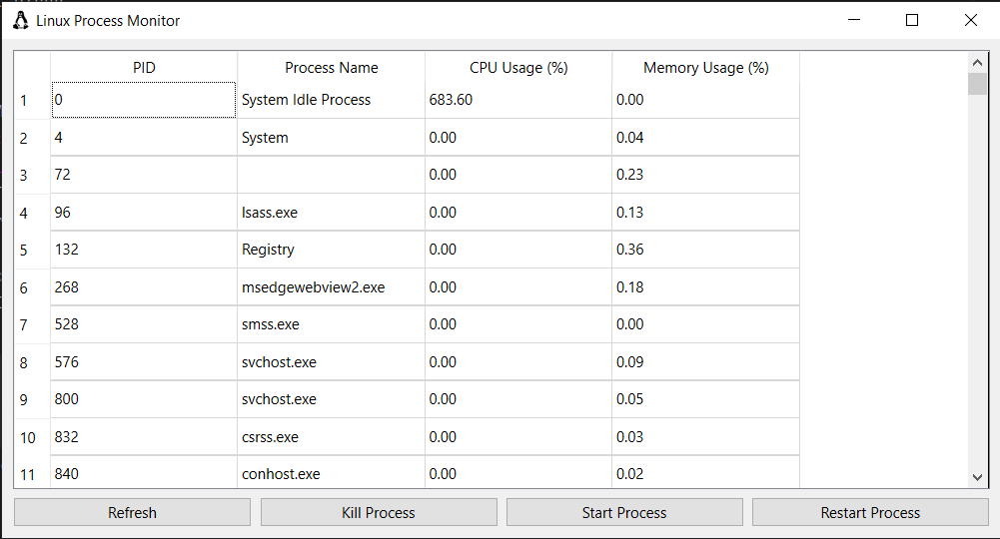
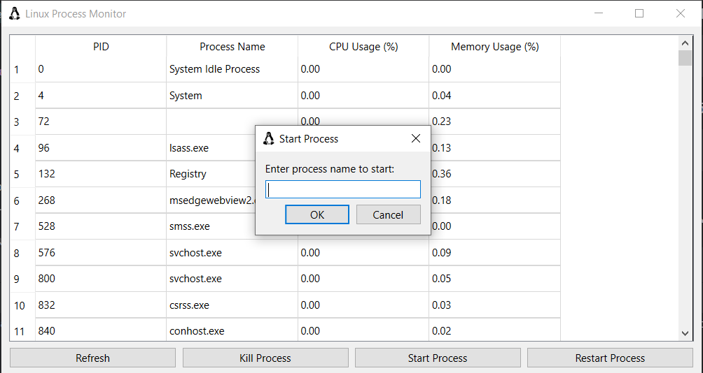

# Linux Process Monitor

## Overview
Linux Process Monitor is a graphical user interface (GUI) application developed using Python, the PyQt6 framework, and the psutil library. This application allows users to monitor and manage running processes on a Linux system effectively. Users can view process details, including Process IDs (PID), CPU usage, and memory usage. Additionally, users can start, stop, and restart processes directly from the interface.

## Features
- **Process Monitoring**: Displays real-time information about running processes, including PID, process name, CPU usage, and memory usage.
- **Process Management**: Easily start, kill, or restart processes using the application interface.
- **User-Friendly GUI**: Built using PyQt6, the application provides a modern and intuitive interface.
- **Auto-Refresh**: The process list is automatically refreshed every 10 seconds for up-to-date information.

## Requirements
- Python 3.10 or later
- PyQt6
- psutil

## Installation

### 1. Clone the Repository
```bash
git clone <repository-url>
cd <repository-folder>
```

### 3. Set Up a Virtual Environment (Optional but recommended)
```bash
python -m venv venv
source venv/bin/activate # For Windows use `venv\Scripts\activate`
```

### 4. Install Required Packages
```bash
pip install -r requirements.txt
```

### 5. Run the Application
```bash
python monitoring.py
```

## Usage
- The application displays a list of running processes with details such as PID, process name, CPU usage, and memory usage.
- Users can start, kill, or restart processes using the buttons provided.
- The process list is automatically refreshed every 10 seconds to display up-to-date information.
- Users can search for specific processes using the search bar.
- The application provides a user-friendly interface for monitoring and managing processes on a Linux system.

## Screenshots



